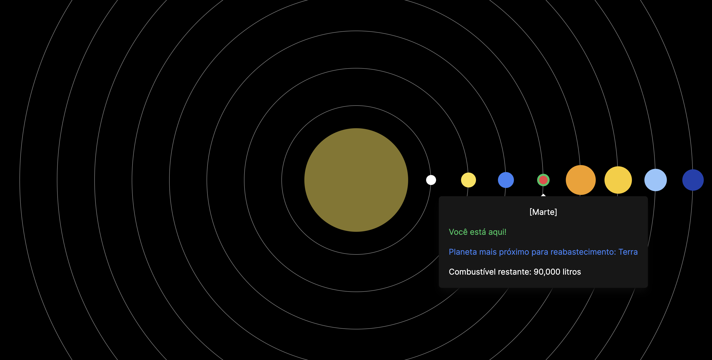
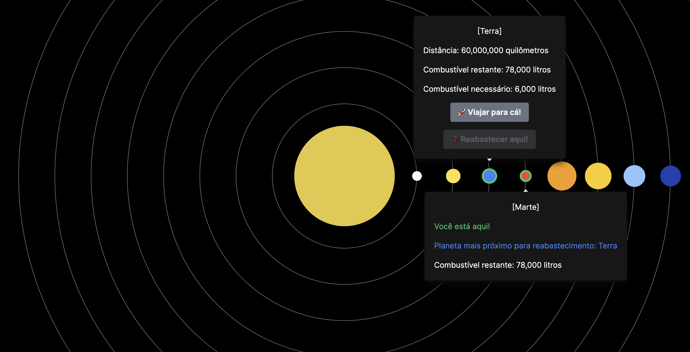

### Detailed Documentation for Space Route Planning System

#### 1. Introduction

The Space Route Planning System is designed to assist astronauts in planning interplanetary trips, simulating fuel requirements, and identifying refueling points. The application is built using React and Next.js, styled with Tailwind CSS, and supports multiple languages through a custom i18n system.



#### 2. Project Structure

```plaintext
src/
|-- app/
|-- components/
|-- contexts/
|-- i18n/
|-- types/
|-- utils/
```

- **app**: Contains application-level configurations and initializations.
- **components**: Contains reusable UI components.
- **contexts**: Context and state management for space navigation.
- **i18n**: Localization configuration and language files.
- **types**: TypeScript type definitions.
- **utils**: Utility functions for space navigation logic.

#### 3. State Management

The application state is managed using the Context API. The `spaceNavigationContext.tsx` file defines the state and actions for managing the spaceship's and planets' states. The `useSpaceNavigation` hook is used to access and manipulate this state within the application.

**File Path**: `src/contexts/spaceNavigationContext/spaceNavigationContext.tsx`

#### 4. User Interface

The user interface is built with reusable components styled using Tailwind CSS. Radix UI components enhance user experience with accessible and high-quality elements.

**Example Component**: LanguageSelector

**File Path**: `src/components/LanguageSelector/LanguageSelector.tsx`

### 5. Route and Fuel Calculation

The logic to calculate the required fuel is based on the distance between planets and the spaceship's fuel consumption ratio. The distances between planets are defined in a constant object `PLANET_DISTANCES`. The fuel needed for a trip is calculated by multiplying the distance by the spaceship's fuel consumption ratio.

**PLANET_DISTANCES Constant**:
```typescript
export const PLANET_DISTANCES: Record<
  IPlanetNames,
  Record<IPlanetNames, number>
> = {
  mercury: {
    mercury: 0,
    venus: 50_000_000,
    earth: 90_000_000,
    mars: 140_000_000,
    jupiter: 490_000_000,
    saturn: 1_190_000_000,
    uranus: 2_090_000_000,
    neptune: 2_790_000_000,
  },
  venus: {
    mercury: 50_000_000,
    venus: 0,
    earth: 40_000_000,
    mars: 100_000_000,
    jupiter: 440_000_000,
    saturn: 1_140_000_000,
    uranus: 2_040_000_000,
    neptune: 2_740_000_000,
  },
  earth: {
    mercury: 90_000_000,
    venus: 40_000_000,
    earth: 0,
    mars: 60_000_000,
    jupiter: 410_000_000,
    saturn: 1_110_000_000,
    uranus: 2_010_000_000,
    neptune: 2_710_000_000,
  },
  mars: {
    mercury: 140_000_000,
    venus: 100_000_000,
    earth: 60_000_000,
    mars: 0,
    jupiter: 350_000_000,
    saturn: 1_050_000_000,
    uranus: 1_950_000_000,
    neptune: 2_650_000_000,
  },
  jupiter: {
    mercury: 490_000_000,
    venus: 440_000_000,
    earth: 410_000_000,
    mars: 350_000_000,
    jupiter: 0,
    saturn: 700_000_000,
    uranus: 1_600_000_000,
    neptune: 2_300_000_000,
  },
  saturn: {
    mercury: 1_190_000_000,
    venus: 1_140_000_000,
    earth: 1_110_000_000,
    mars: 1_050_000_000,
    jupiter: 700_000_000,
    saturn: 0,
    uranus: 900_000_000,
    neptune: 1_600_000_000,
  },
  uranus: {
    mercury: 2_090_000_000,
    venus: 2_040_000_000,
    earth: 2_010_000_000,
    mars: 1_950_000_000,
    jupiter: 1_600_000_000,
    saturn: 900_000_000,
    uranus: 0,
    neptune: 700_000_000,
  },
  neptune: {
    mercury: 2_790_000_000,
    venus: 2_740_000_000,
    earth: 2_710_000_000,
    mars: 2_650_000_000,
    jupiter: 2_300_000_000,
    saturn: 1_600_000_000,
    uranus: 700_000_000,
    neptune: 0,
  },
};
```

**Explanation**:
- `PLANET_DISTANCES`: A constant that holds the distances (in kilometers) between each pair of planets.
- Each planet has an entry with the distances to all other planets. For example, the distance from Mercury to Venus is 50,000,000 kilometers, while the distance from Earth to Mars is 60,000,000 kilometers.

**Fuel Calculation**:
To determine the fuel needed to travel between planets, the distance is multiplied by the spaceship's fuel consumption ratio.

**Example Calculation**:
```typescript
const distanceFromSpaceship = PLANET_DISTANCES[currentPlanet][planet.name];
const fuelNeededToTravelTo = distanceFromSpaceship * 0.0001;
```

**Explanation**:
- `currentPlanet`: The planet where the spaceship is currently located.
- `planet.name`: The name of the target planet to which the spaceship intends to travel.
- `distanceFromSpaceship`: The distance from the current planet to the target planet, retrieved from the `PLANET_DISTANCES` constant.
- `fuelNeededToTravelTo`: The fuel required to travel from the current planet to the target planet, calculated by multiplying the distance by the spaceship's fuel consumption ratio (`0.0001` in this example).

**Fuel Consumption Ratio**:
- The fuel consumption ratio (`0.0001`) is a constant that represents the amount of fuel consumed per kilometer traveled. This ratio is used to convert the distance into the fuel required for the trip. For example, if the distance to the target planet is 50,000,000 kilometers, the fuel needed would be `50,000,000 * 0.0001 = 5000` liters of fuel.

#### 6. Multilingual Support

Multilingual support is implemented using react-i18next. Language files are stored in the `i18n` directory.

**Language Files**:

- `src/i18n/en.json`
- `src/i18n/pt.json`
- `src/i18n/i18n.ts`

#### 7. Testing

Unit and integration tests are written using Jest and React Testing Library. The focus is on testing behavior and ensuring all behavior cases are covered. By testing integrations and UI, we automatically cover the hooks, utilities, and functions within the code. There is no need to test other parts of the app if all behavior cases are thoroughly tested.

**Example Test**: Planet Component Tests

**File Path**: `src/components/Planet/Planet.test.tsx`

#### 8. UI Usability and Interaction Flow

The Space Route Planning System starts by randomly choosing a planet for the spaceship to initiate. Here is the detailed flow of UI usability and interaction:

1. **Initial State**:

   - When the app starts, a random planet is selected as the starting point for the spaceship.

2. **Hovering Over Planets**:

   - When a user hovers over a planet, a hover card appears displaying all relevant information about the planet. This includes:
     - The planet's name.
     - Whether it is the current location of the spaceship.
     - The nearest planet for refueling.
     - The distance from the spaceship to the planet.
     - The remaining fuel in the spaceship.
     - The fuel needed to travel to the planet.



3. **Hover Card Information Rules**:

   - **Display Rules**:
     - The hover card appears when the user hovers over a planet and hides when the hover is removed.
     - If the planet is the current location of the spaceship, the hover card displays the current status and the nearest refuel station.
     - If the planet is not the current location, it shows the distance and the fuel needed for travel.
   - **Button Enable/Disable and Hide Rules**:
     - **Travel Button**:
       - Enabled if the spaceship has enough fuel to travel to the planet.
       - Disabled and hidden if the spaceship does not have enough fuel to travel to the planet.
     - **Refuel Button**:
       - Enabled if the planet is the current location, has a refuel station, and the spaceship is not already at full capacity.
       - Disabled and hidden if the spaceship is already at full capacity or if the planet does not have a refuel station.

4. **Hover Effects**:
   - **Green Border**:
     - The planet shows a green border on hover if the spaceship has enough fuel to travel to that planet.
   - **Red Border**:
     - The planet shows a red border on hover if the spaceship does not have enough fuel to travel to that planet.
   - **Red Fuel Text**:
     - The remaining fuel text appears in red if the fuel needed to travel to the planet exceeds the current fuel in the spaceship.

### Instructions to Run Tests and Deploy the Application

1. **Install Dependencies**: Ensure all dependencies are installed:

   ```bash
   npm install
   ```

2. **Run Development Server**: Start the development server:

   ```bash
   npm run dev
   ```

3. **Build the Application**: Build the application for production:

   ```bash
   npm run build
   ```

4. **Start the Production Server**: Start the server in production mode:

   ```bash
   npm start
   ```

5. **Run Tests**: Execute unit and integration tests:
   ```bash
   npm test
   ```
   - **Watch Mode**: Run tests in watch mode:
     ```bash
     npm run test:watch
     ```
   - **Coverage Report**: Generate a test coverage report:
     ```bash
     npm run test:coverage
     ```

This documentation provides a clear and comprehensive explanation of the application, its architecture, route and fuel calculation logic, multilingual support implementation, and user interaction flow. It also includes detailed instructions on how to run tests and deploy the application.
